# Animation Tool

:::tip[Design Tool]
可视化动画配置工具库, 用于配置动画和Inspector函数操作
:::

## Timeline Player

* 基于时间轴的动画播放器, 可以使用Unity的`TimelineAsset`的动画面板配置时间轴动画
* [Timeline Unity官方教程](https://docs.unity3d.com/Packages/com.unity.timeline@1.8/manual/index.html)
  (在框架中部分遵循这个教程)

### 组件介绍

1. **Timeline Asset**
    * Unity中的可配置的Timeline数据文件, 每一个**Timeline Asset**都是一个完整的动画配置文件
    * 其可以配置多个**Timeline Track**, 通过不同的**Timeline Track**组合实现各种丰富的动画功能
    * 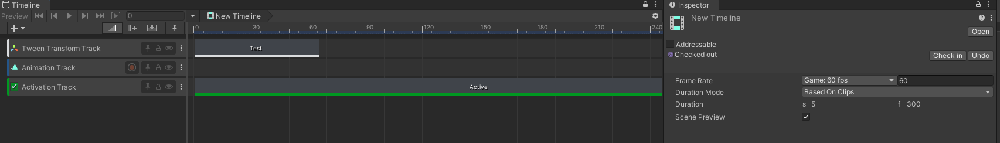
2. **Timeline Track**
    * 每一个**Timeline Track**都绑定到一个具体的`UnityEngine.Object`对象, 在**Timeline Asset**的生命周期中, 基于
      拥有的所有**Timeline Clip**去控制这个Unity对象的动画逻辑
    * 每一个**Timeline Track**可以绑定多个**Timeline Clip**, 完成对一个Unity对象的完整动画逻辑
    * **Timeline Track**有这特殊的对象绑定逻辑, 参考[组件索引](#组件索引)
3. **Timeline Clip**
    * Timeline中的最小动画单位, 基于**Timeline Track**去控制一个`UnityEngine.Object`对象在一段时间内的动画操作
    * 每个**Timeline Clip**可能会存在对同一个对象的多个不同属性进行动画控制, 可以单独激活或不激活某一个特定的动画逻辑操作
    * 不同的**Timeline Clip**作用可以参考[Timeline Clip](TimelineClip.md)
    * 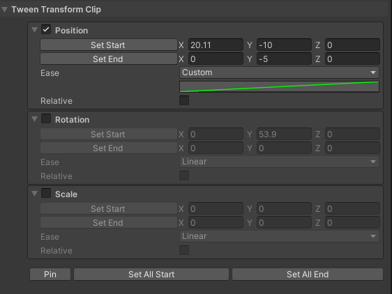
4. **Timeline Player**
    * 是一个`MonoBehaviour`组件, 可以被直接添加到`GameObject`上
    * 可以用于在`Editor`或者`Runtime`模式下去播放**Timeline Asset**中的动画逻辑
    * (在配置动画的时候建议在`Editor`模式下配置和播放动画, 即不运行游戏配置动画,
      这样可以避免在部分情况下配置动画数据无法保存的问题)
    <details>
        <summary><b>配置字段</b></summary>
        * `Timeline Asset`: **Timeline Player**正在播放的**Timeline Asset**动画素材
        * `Timeline Root`: **Timeline Player**正在基于那一个根物体进行动画播放(和[组件索引](#组件索引)强相关)
        * `Play Mode`: **Timeline Player**的播放模式. None, 默认模式, 正常播放动画; Reverse, 翻转模式, 将反向播放动画(包括`MoveStartFrame`和`MoveEndFrame`效果也会对调); Ping Pong, 乒乓模式, 来回播放动画, 动画时长变为默认的两倍
        * `Play On Awake`: 在`Runtime`模式下, 是否在启动时就尝试播放动画(通常设置为`False`)
        * `Is Loop`: 是否循环播放**Timeline Player**的动画
    </details>

### 配置操作

1. 创建**Timeline Player**组件, 创建并绑定**Timeline Asset**资产和**Timeline Root**绑定根物体
    * 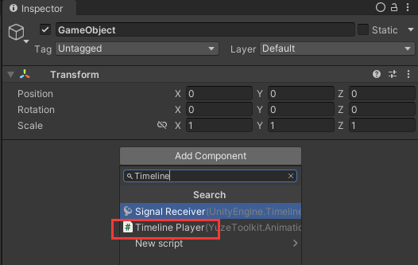
    * 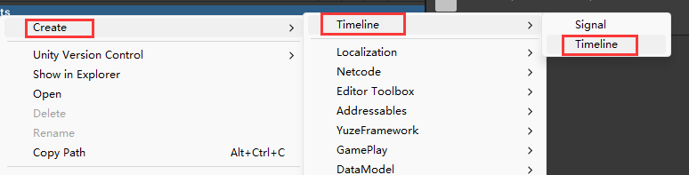
    * 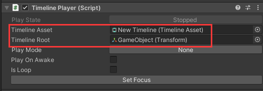
2. 打开`Timeline`窗口和`Timeline Player`窗口, 并且通过`Set Focus`绑定对应的**Timeline Player**
    * 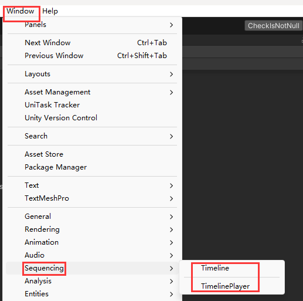
    * 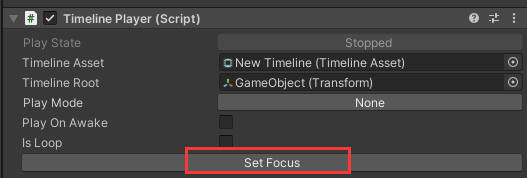
    * 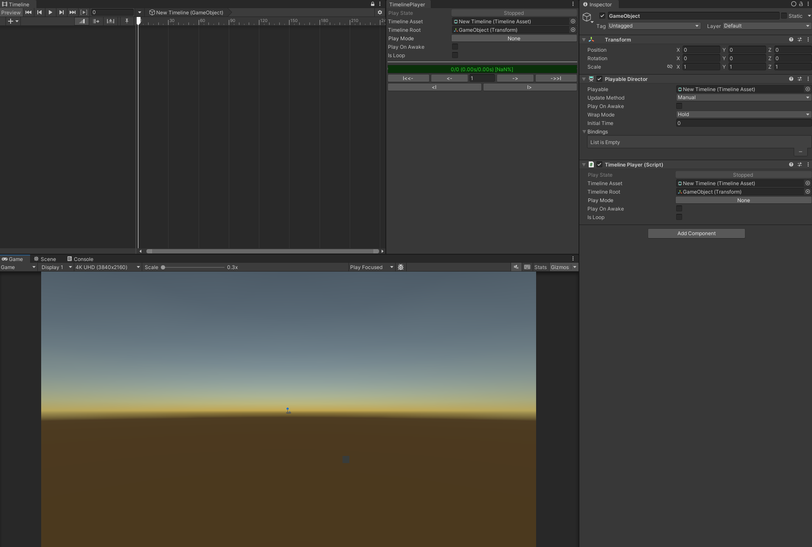
3. 基于[组件索引](#组件索引)规则创建对应的**Timeline Track**和**Timeline Clip**, 配置不同的**Timeline Track**名称,
   达到不同对象索引效果
    * 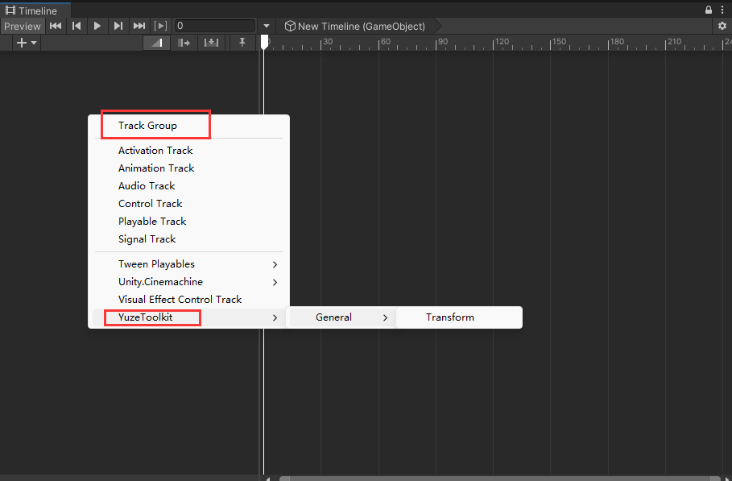
    * 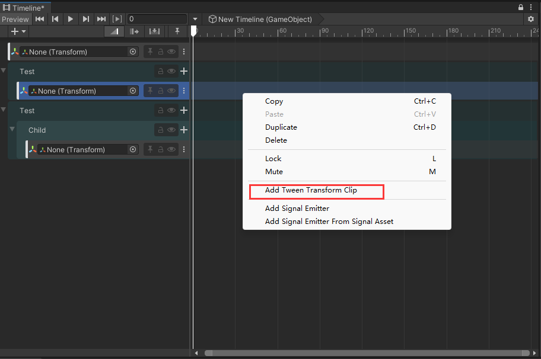
    * 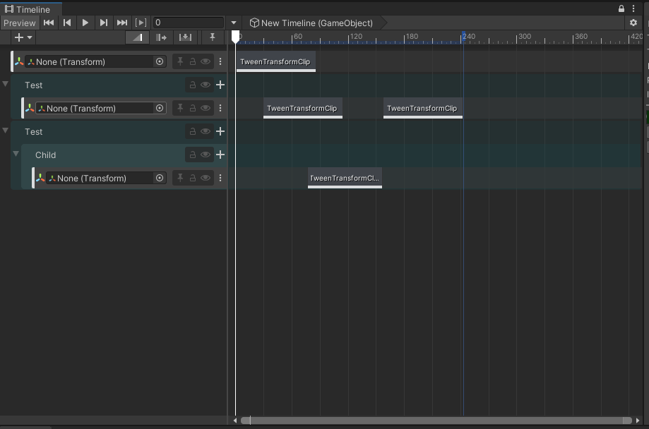
4. 调整**Timeline Clip**的配置, 完成动画制作, 参考[Timeline Clip](TimelineClip.md)

### 组件索引

* 在配置过程中, 为了将对象配置和数据分离, 这里额外定义了一种基于`Transform`子父物体层级定位的语法
    * 参考:

        ```
        $name_test
        |  | |  └── 查找的参数(此时是查找的名称, 默认查找名称时是忽略大小写的, 只要字母匹配即可)
        |  | └───── 查找方法的结束标识(用于区分方法和参数)
        |  └─────── 查找的方法(此处是基于名称匹配, 基于子物体查找都为广度优先搜索)
        └────────── 查找的开头标识(所有的组件索引逻辑通常都应该以`$`开头)
        ```

    1. `$name_test` -> 基于广度优先查找当前`Transfrom`所有子物体中, 名称为`test`(`TEST`)的物体

        ```
        $name@notIgnoreCase@array_test1|test2|test3
             |             |           └── 数组查找的参数分割符, 会基于这个符号将查找的参数拆分为一个数组
             |             └───── (这是一个数组Tag, 代表将查找的参数拆分为一个数组, 每个对象单独查找, 获取第一个返回值)
             └─────── 查找Tag, 部分查找方法会因为存在不同Tag额改变逻辑(这里是一个不忽略大小的Tag, 这样名称查找就会进行精确匹配)
        ```

    2. `$name@notIgnoreCase@array_test1|test2|test3` -> 基于广度优先查找当前`Transfrom`所有子物体中,
       名称为`test1`/`test2`/`test3`的物体, 并且不忽略大小写, 返回第一个获取的值

        ```
        $path_$name_test1/$name_test2/$name_test3
          |              └── 数组查找的参数分割符, 会基于这个符号将查找的参数拆分为一个数组
          └───── 特殊的查找方法, 将查找的参数拆分为一个数组, 将数组元素再次作为一个完整的参数, 再次进行查找
        ```

    3. `$path_$name_test1/$name_test2/$name_test3` -> 基于查找路径搜索, 先基于广度优先查找当前`Transfrom`所有子物体中,
       名称为`test1`(`TEST1`)的物体; 再查找`test2`(`TEST2`)的物体; 最后查找`test3`(`TEST3`)的物体, 返回最后查找到的对象

        ```
        $p_../testPanel/$name@a_test1|test2|test3
         |  |     |           └── 查找Tag简称: array -> a
         |  |     └───── 名称查找简称(没有`$`开头时, 默认即为名称查找), 等价 -> $name_testPanel
         |  └─────── 向上层级, 获取到父物体
         └────────── 查找的方法检查: path -> p
        ```
    4. `$p_../testPanel/$name@a_test1|test2|test3` -> 基于查找路径搜索, 先获取当前对象的父物体;
       再查找`testPanel`(`TESTPANEL`)的物体; 最后查找名称为`test1`/`test2`/`test3`的物体, 返回最后查找到的对象
        * `path`路径查找还可以直接省略`$p_`, 等价 -> `../testPanel/$name@a_test1|test2|test3`
        * 在没有`$`开头时, 如果没有路径标识符`/`, 则使用`$name_`名称查找; 如果有路径标识符`/`, 则使用`$path_`路径查找;

<details>
    <summary><b>查询细则</b></summary>
    1. 查找的方法
        * Path(P): 基于路径多次进行搜索
        * Index(I): 基于索引进行查找(索引从0开始)
        * Name(N): 基于名称进行查找
        * StartsWith(S): 基于名称前缀进行查找
        * EndsWith(E): 基于名称后缀进行查找
        * Contains(C): 基于名称包含进行查找
        * Match(M): 基于正则表达式进行查找
    2. 查找Tag
        * NotIgnoreCase(NIC): 不忽略大小写, 默认忽略大小写
        * Array(A): 将查找的参数拆分为一个数组, 将数组元素再次作为一个完整的参数, 再次进行查找
</details>

* 在**Timeline Asset**每一个`Track Group`都对应这一次查询, 可以通过嵌套`Track Group`来完成复杂的查询
* 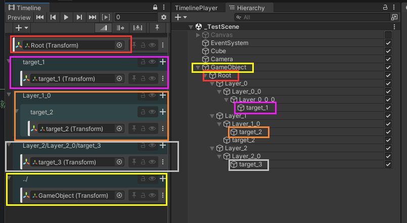

## Action Invoker

* 可视化的队列播放器, 可以**Inspector**面板上配置具有顺序的操作逻辑

### 组件介绍

1. **Action**
    * 可配置的操作的最小单位, 每一个**Action**只完成一个操作, 一个完整的操作通常是由多个不同的**Action**组合而成
    * **Action**通常有两种类型:
        1. 等待类**Action**: 这种**Action**通常都需要等待一段时间才能完成
            1. `Delay`: 延迟一定秒数执行
            2. `DelayFrame`: 延迟一定帧数执行
        2. 立即执行类**Action**: 这种**Action**都是立刻完成, 并且返回(或者执行下一个**Action**)
            1. `UnityEvent`: **Inspector**可配置方法
    * 其他**Action**详细的类型说明请参考[Action](Action.md)
2. **Action Group**
    * 由多个**Action**组合而成, 完成一个完整的操作逻辑
    * **Action Group**也是一种特殊的**Action**, 可以在配置时嵌套使用, 实现各种复杂的功能
    <details>
        <summary><b>配置字段</b></summary>
        * `Is Parallel`: 是否为并行运行. 如果为`True`, 则所有的`actions`同时开始执行; 如果为`False`, 则所有的`actions`按照顺序一个个单独执行
        * `Force Catch Exception`: 在一个**Action**触发异常之后, 是否强制捕获当前异常, 继续执行队列. 如果为`True`,则在任何时候都会尽可能保证队列执行完成; 如果为`False`, 则在队列中出现异常的时候回直接暂停队列的执行
        * `Is Repeat`: 是否在触发之后重复执行此队列, 等待当前任务被取消
        * `Repeat Count`: 重复执行队列的次数; 如果小于等于0, 则代表无限循环执行
        * `Actions`: **Action Group**配置的所有操作
    </details>
3. **Action Invoker**
    * 是一个`MonoBehaviour`组件, 可以被直接添加到`GameObject`上
    * 拥有一个`Action List`, 可以在`List`中配置不同的**Action**
    * 每一个**Action**都是单独触发, 单独完成一个小的任务
    * 并且每一个**Action**都可以配置一个`key`(字符串类型), 用于快速索引
    * 有一个`Start`的`UnityEvent`方法, 可以在`Inspector`面板上配置触发操作
    <details>
        <summary><b>方法名称</b></summary>
        * `Invoke(int index)`: 基于配置的顺序触发一个**Action**(配置的顺序从0开始)
        * `Invoke(string key)`: 基于配置的`key`触发一个**Action**
        * `InvokeWithCancellationToken(int index)`:  基于配置的顺序触发一个带有`CancellationToken`的**Action**(配置的顺序从0开始)(带有`CancellationToken`的**Action**可以取消执行)
        * `InvokeWithCancellationToken(string key)`: 基于配置的`key`触发一个带有`CancellationToken`的**Action**(带有`CancellationToken`的**Action**可以取消执行)
            * 其中`key`值有两种类型:
                1. 默认索引`key`: `XXXXX`, 将直接用于查找**Action**, 并且同时作为取消**Action**操作的`key`
                2. 组合索引`key`: `XXXXX-YYYYY`, 将`XXXXX`作为查找**Action**的`key`, 将`YYYYY`作为取消**Action**操作的`key`
        * `Cancel(int index)`: 基于配置的顺序取消一个**Action**(配置的顺序从0开始)
        * `Cancel(string key)`: 基于配置的`key`取消一个**Action**或者一组**Action**(如果大量的**Action**绑定的是同一个取消`key`, 则会一次性取消一组)
    </details>
4. **Action Group Invoker**
    * 是一个`MonoBehaviour`组件, 可以被直接添加到`GameObject`上
    * 拥有一个`Action Group List`, 可以在`List`中配置不同的**Action Group**
    * 每一个**Action Group**都是单独触发, 单独完成一个完整的任务
    * 并且每一个**Action Group**都可以配置一个`key`(字符串类型), 用于快速索引
    * 有一个`Start`的`UnityEvent`方法, 可以在`Inspector`面板上配置触发操作
    <details>
        <summary><b>方法名称</b></summary>
        * `Invoke(int index)`: 基于配置的顺序触发一个**Action Group**(配置的顺序从0开始)
        * `Invoke(string key)`: 基于配置的`key`触发一个**Action Group**
        * `InvokeWithCancellationToken(int index)`:  基于配置的顺序触发一个带有`CancellationToken`的**Action Group**(配置的顺序从0开始)(带有`CancellationToken`的**Action Group**可以取消执行)
        * `InvokeWithCancellationToken(string key)`: 基于配置的`key`触发一个带有`CancellationToken`的**Action Group**(带有`CancellationToken`的**Action Group**可以取消执行)
            * 其中`key`值有两种类型:
                1. 默认索引`key`: `XXXXX`, 将直接用于查找**Action Group**, 并且同时作为取消**Action Group**操作的`key`
                2. 组合索引`key`: `XXXXX-YYYYY`, 将`XXXXX`作为查找**Action Group**的`key`, 将`YYYYY`作为取消**Action Group**操作的`key`
        * `Cancel(int index)`: 基于配置的顺序取消一个**Action Group**(配置的顺序从0开始)
        * `Cancel(string key)`: 基于配置的`key`取消一个**Action Group**或者一组**Action Group**(如果大量的**Action Group**绑定的是同一个取消`key`, 则会一次性取消一组)
    </details>

### 配置操作

1. 添加**Action Invoker**或者**Action Group Invoker**组件
    * **Action Invoker**通常用于处理单一简单的逻辑任务(默认建议使用这个组件)
    * **Action Group Invoker**通常用于处理复杂的逻辑任务
    * 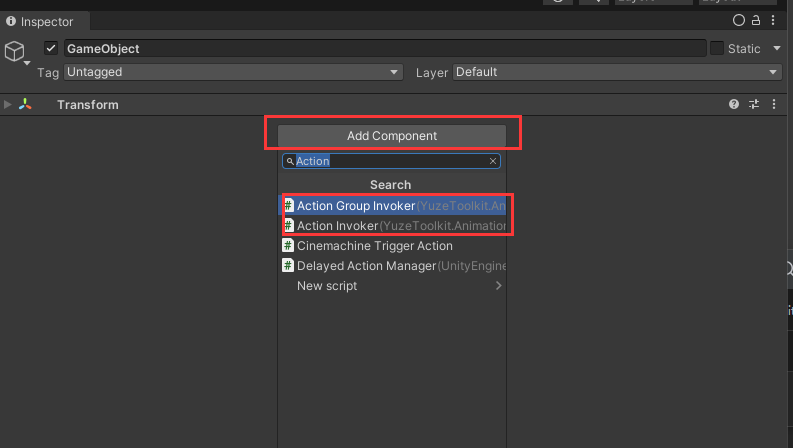
2. 创建**Action**或者**Action Group**(下面都一**Action**配置作为范例, **Action Group**配置同理)
    * 红色框显示的当前组件初始化时激活的事件, 可以配置初始化逻辑
    * 蓝色框显示是可配置的**Action**(**Action Group**), 可以手动添加和删减对应的**Action**(**Action Group**)
    * 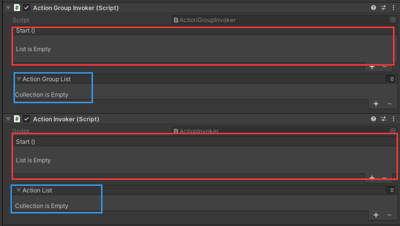
    * `+`添加对应的**Action**, 可以给不同的**Action**配置不同的`key`(索引使用, 非必须), 并且下拉可以选项不同的**Action**
      类型, 配置对应的参数
    * 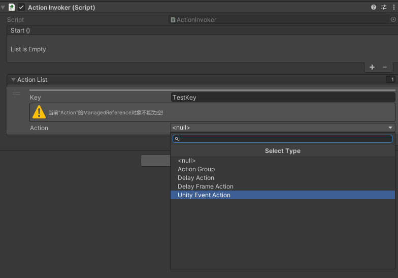
    * 可以添加多个不同的**Action**(**Action Group**), 每个**Action**(**Action Group**)的逻辑都完全独立, 而且可以嵌套配置
      **Action Group**, 来实现复杂逻辑(注意**Action Group**逻辑特殊, 具体配置逻辑请查看[Action](Action.md))
    * 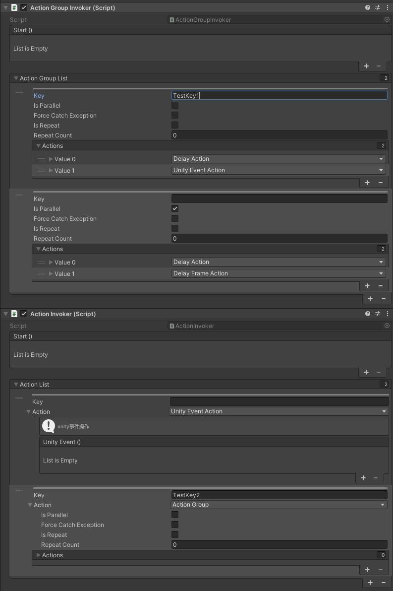
3. 触发事件
    * 事件触发使用的Unity的`UnityEvent`, 可以同时配置多个不同的事件
    * 配置时, 先选择需要配置的对象; 然后选择对象上对应需要访问方法的组件; 最后选择组件中特定的方法. 可以给有参数的方法设置参数的值,
      但是事件仅支持以下几种基础类型
        1. Empty(空)
        2. `int`
        3. `float`
        4. `string`
        5. `bool`
        6. 所有的`UnityEngine.Object`
    * 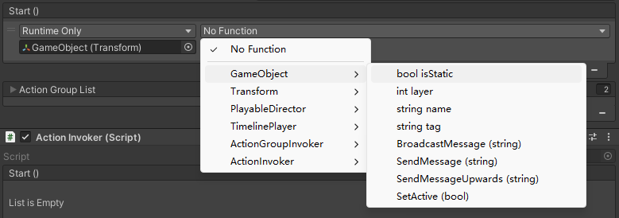
    * 下面是一个参考, 分别配置了:
        1. 对一个`GameObject`失活的操作(bool值设置)
        2. 触发一个空参方法
        3. 触发`ActionInvoker`的`Invoke(int index)`方法
        4. 触发`ActionGroupInvoker`的`Invoke(string key)`方法
    * 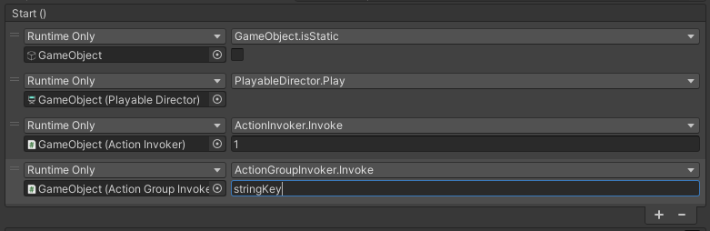
4. 配置特殊**Action**对象索引
    * 具体配置数据参考[Action](Action.md), 配置逻辑参考**Timeline Player**的[组件索引](#组件索引)

#

<br/><br/><br/>
:::info[Code Tool]
通过代码拓展动画工具库
:::

## Timeline Player

* 待完善

## Action Invoker

* 待完善
